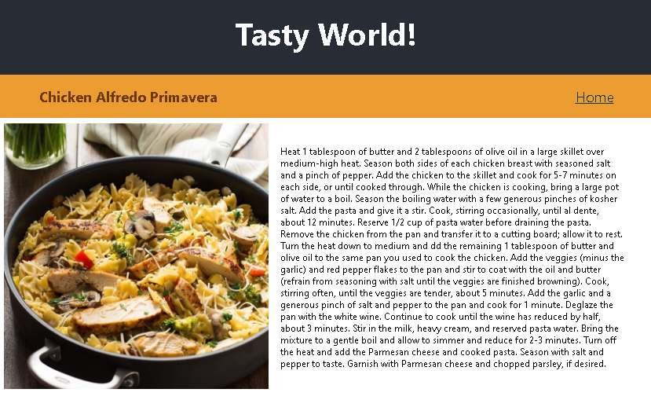

## Built With

- React
- Redux
- Javascript
- CSS

## Live Demo

[RecipeCook ON HEROKU](https://tranquil-mesa-95078.herokuapp.com/)

## Screen shot

## Video Presentation
[App presentation and demo](https://www.loom.com/share/caa9e466aba145589986369afa982cfe)

[Technical Aspects of App](https://www.loom.com/share/a0e65588799d425d979605dc06bc1b05)

[How I used Redux in this app](https://www.loom.com/share/f5e4acf4db264cf5ae04409fe9cecc8e)

## Author

👤 Carlos Prieto Barron

- Github: [@carlosprietobarron](https://github.com/carlosprietobarron)
Linkedin: [Carlos Prieto Barrón](https://www.linkedin.com/in/carlosprietobarron/)
## 🤝 Contributing

Contributions, issues and feature requests are welcome!

Feel free to check the [issues page](issues/).

## Show your support

Give a ⭐️ if you like this project!

## Acknowledgments

- Hat tip to anyone whose code was used
- Inspiration
- etc

## 📝 License

This project is [MIT](lic.url) licensed.
